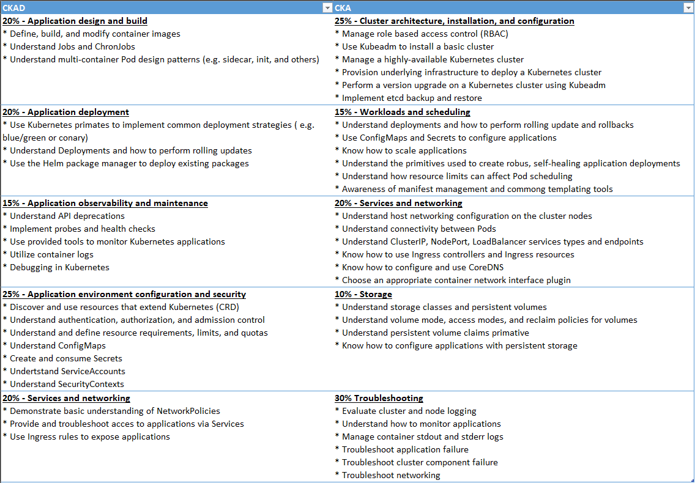

# Kubernetes certification preparation
Notes to help study for a Kubernetes certification.

> I will be focusing on the CKAD certification as I have very little interest in cluster installation and configuration, which would be 25% of the exam, and I plan to use cloud offerings that handle most of that. See [CKAD and CKA comparison](#ckad-and-cka-curriculum-comparison).

## Curricula
* [Curriculum documentation source](https://github.com/cncf/curriculum)
  * [CKAD](https://github.com/cncf/curriculum/blob/master/CKAD_Curriculum_v1.23.pdf) - Certified Kubernetes Application Developer
  * [CKA](https://github.com/cncf/curriculum/blob/master/CKA_Curriculum_v1.22.pdf) - Certified Kubernetes Administrator
  * [CKS](https://github.com/cncf/curriculum/blob/master/CKS_Curriculum_%20v1.22.pdf) - Certified Kubernetes Security Specialist
  * [KCNA](https://github.com/cncf/curriculum/blob/master/KCNA_Curriculum.pdf) - Kubernetes and Cloud Native Association 

---

### CKAD
1. [Application design and build](docs/application-design-and-build.md) - 20%
   * [ ] Define, build, and modify container images
   * [ ] Understand Jobs and ChronJobs
   * [ ] Understand multi-container Pod design patterns (e.g. sidecar, init, and others)
2. [Application deployment](docs/application-deployment.md) - 20%
   * [ ] Use Kubernetes primates to implement common deployment strategies ( e.g. blue/green or conary)
   * [ ] Understand Deployments and how to perform rolling updates
   * [ ] Use the Helm package manager to deploy existing packages
3. [Application observability and maintenance](docs/application-observability-and-maintenance.md) - 15%
   * [ ] Understand API deprecations
   * [ ] Implement probes and health checks
   * [ ] Use provided tools to monitor Kubernetes applications
   * [ ] Utilize container logs
   * [ ] Debugging in Kubernetes
4. [Application environment configuration and security](docs/application-environment-configuration-and-security.md) - 25%
   * [ ] Discover and use resources that extend Kubernetes (CRD)
   * [ ] Understand authentication, authorization, and admission control
   * [ ] Understand and define resource requirements, limits, and quotas
   * [ ] Understand ConfigMaps
   * [ ] Create and consume Secrets
   * [ ] Understand ServiceAccounts
   * [ ] Understand SecurityContexts
5. [Services and networking](docs/services-and-networking.md) - 20%
   * [ ] Demonstrate basic understanding of NetworkPolicies
   * [ ] Provide and troubleshoot access to applications via Services
   * [ ] Use Ingress rules to expose applications

---

### CKAD and CKA curriculum comparison

